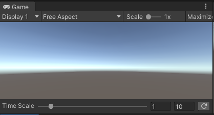

# Time Tools

## Description
Provides tools to manage GameTime such as pausing or controlling time scale for testing.

## Setup
This tool has no dependencies other than the Unity editor itself and becomes available by enabling the toolbar via the main menu Nementic/Utility/Show Time Scale Toolbar. The currently verified Unity Version is 2019.3.
